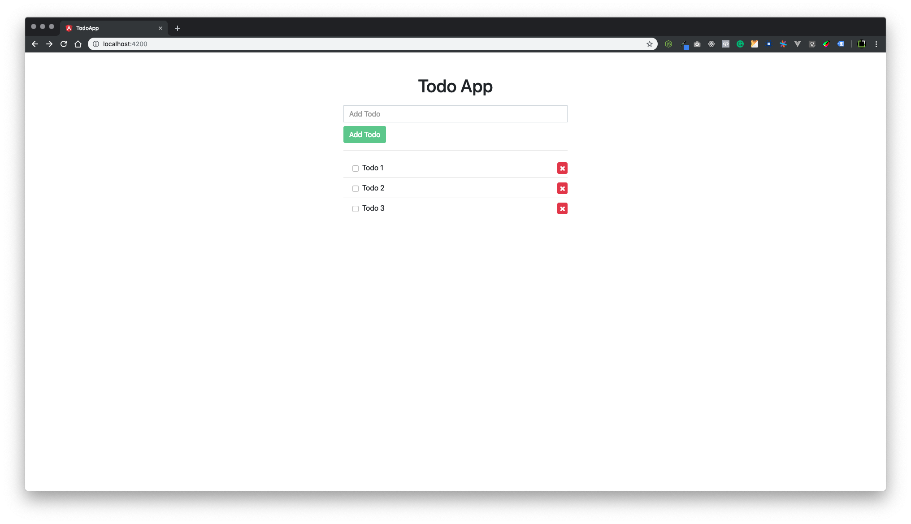

# Todo App

This project was generated with [Angular CLI](https://github.com/angular/angular-cli) version 7.3.3. 
[](https://travis-ci.org/chalermporn/todo-app)
<p align="center"></p>

## Quick start

- Clone following repo:

```sh
git clone https://github.com/chalermporn/todo-app.git .
```

note "." at the end. It will clone files directly into current folder.

- Run `npm i`
- Run `npm start`
- Here! Open browser and visit <http://localhost:4200>
